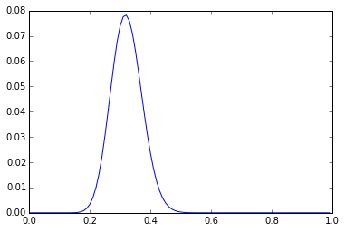
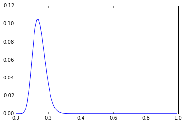

Bayesian model for Edwards et al., "Denying Rape but Endorsing Forceful Intercourse: Exploring Differences Among Responders," Violence and Gender 1:4, 2014. DOI:10.1089/vio.2014.0022.  

[http://online.liebertpub.com/doi/pdf/10.1089/vio.2014.0022]()

Men who would intend to force a woman to have sex: 

Men who would intend to rape:  

